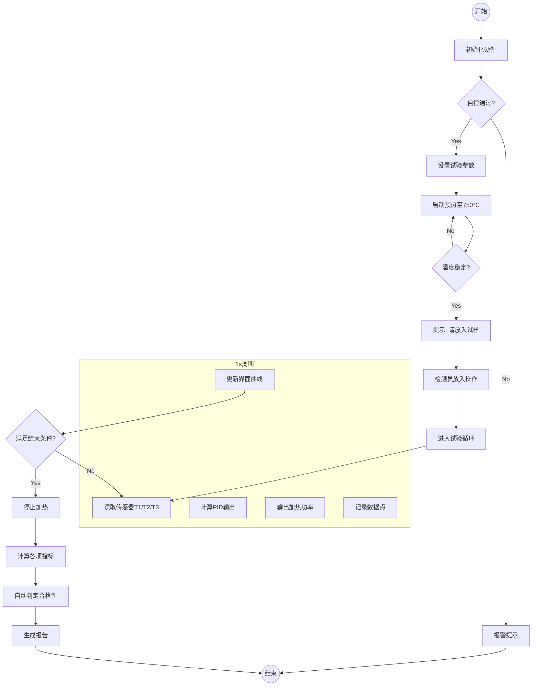

# 第3章 软件需求工程与开发文档编写

> 你有没有遇到过这样的场景：花了三个月开发的软件，用户看了一眼说"这不是我要的"？在工业领域，这种错误的代价更大——需求理解偏差可能导致设备失控、检测数据失准，甚至引发安全事故。
>
> 本章将系统介绍**需求工程**的方法与实践，帮助你学会如何从用户那里获取真实需求、如何将模糊的需求转化为精确的规格说明，以及如何用图形化建模避免理解歧义。

## 学习目标

- **理解** 需求工程在软件开发中的核心地位及其对项目成败的影响
- **掌握** 需求获取的常用方法（访谈、观察、原型法）及其在工业场景下的应用技巧
- **能够** 准确区分并定义功能性需求与非功能性需求
- **学会** 使用UML（用例图、活动图）和DFD（数据流图）进行标准化的需求建模
- **熟练** 编写符合IEEE 830标准的软件需求规格说明书（SRS）
- **了解** 需求变更管理的流程与版本控制的重要性

---

## 3.1 需求获取方法与用户需求分析

需求工程（Requirements Engineering）是软件开发的第一步，也是最关键的一步。统计数据表明，超过50%的软件项目失败或超支，其根源都可以追溯到需求阶段的错误。在工业软件开发中，由于涉及软硬件结合和复杂的工艺流程，需求获取的难度往往更高。

### 3.1.1 需求获取的挑战

在工业项目中，软件工程师通常面临着"领域知识鸿沟"：

*   **语言不通**：检测员使用的是"热电偶"、"PID参数"、"GB标准"等行话，而程序员习惯的是"对象"、"接口"、"数据库"等术语。
*   **默认知识（Tacit Knowledge）**：用户往往认为某些操作是"理所当然"的（例如："试验炉打开后必须预热30分钟"），因此不会主动提及，但这恰恰是软件逻辑必须覆盖的关键点。

为了跨越这个鸿沟，我们需要采用多种需求获取方法。

### 3.1.2 常见的需求获取方法

#### 1. 用户访谈（Interviews）

访谈是最直接的方法，分为结构化访谈（有固定问卷）和非结构化访谈（自由交谈）。

*   **访谈对象**：
    *   **实验室主任**（高层）：关注合规性、报表统计、实验室整体效率。
    *   **资深检测员**（核心用户）：关注操作流程、异常处理、界面易用性。
    *   **设备维护员**：关注硬件接口、故障报警、维护便利性。

> 🔍 **案例实战：一次失败的访谈 vs 成功的访谈**
>
> *   **失败提问**："你们需要什么样的软件功能？"（用户通常答不上来，或者只说"好用就行"）
> *   **成功提问**："在做现在的试验时，最让你头疼的环节是什么？""如果试验过程中突然断电了，你们现在是怎么处理的？"（引导用户讲出痛点和场景）

#### 2. 现场观察（Observation）

"百闻不如一见"。开发者应当深入实验室，旁观一次完整的不燃性试验过程。

*   **观察重点**：
    *   检测员的**视线**停留在哪？（是盯着温度表，还是盯着秒表？）
    *   检测员的**手**在做什么？（是频繁记录数据，还是在操作炉门？）
    *   环境中有哪些**干扰因素**？（噪音、粉尘、振动？）
*   **发现隐藏需求**：通过观察，我们发现检测员在试验开始前，会习惯性地用标准砝码校准天平。这个操作之前未在需求中提及，但软件必须提供"天平校准向导"功能，否则称重数据可能不准。

> ⚠️ **注意：脱离环境谈功能是工业软件的大忌**
>
> 某团队为工厂车间开发了设备监控系统，特意增加了**语音报警功能**。在实验室演示时效果良好，但上线第一天就被工人投诉"根本听不见"——车间背景噪音高达85分贝，普通语音播报瞬间被机器轰鸣声淹没。如果在需求调研阶段实地考察过，就会发现**高亮频闪灯 + 工业蜂鸣器**才是有效的报警方式。

#### 3. 原型法（Prototyping）

在工业软件中，原型法极其有效。虽然用户看不懂UML图，但他们能看懂界面。

*   **低保真原型**：纸笔画出的草图，用于确认流程。
*   **高保真原型**：使用工具（如Axure、墨刀、WinForms设计器）快速拖拽出的界面。
*   **作用**：让用户在开发早期就"看到"系统，尽早提出修改意见，避免开发完成后的返工。

### 3.1.3 用户需求分析：典型用户画像

通过对某省级建材检测中心的深入调研，我们构建了以下用户画像（Persona）：

| 用户角色 | 画像描述 | 核心诉求（User Story） | 痛点分析 |
| :--- | :--- | :--- | :--- |
| **检测员小张** | 25岁，入职2年，每天完成5-8组试验 | "我希望点一个按钮就能开始试验，系统自动帮我记数" | 手工记录繁琐，多任务时容易出错 |
| **技术负责人老李** | 45岁，对数据真实性敏感 | "我希望系统能保留原始温度曲线，且不能被随意修改" | 担心数据被篡改，担心判定不符合GB标准 |
| **实验室主任王总** | 50岁，关注运营效率和资质评审 | "我希望能一键导出报告，快速调出历史数据" | 纸质档案堆积如山，检索困难 |

---

## 3.2 功能性需求与非功能性需求规格说明

将模糊的用户需求转化为清晰、可测试的**系统规格说明**，是需求分析师的核心工作。

### 3.2.1 功能性需求（Functional Requirements）

功能性需求定义了系统**必须具备的行为**。针对不燃性试验系统，我们将功能划分为以下四大模块：

#### F1. 试验配置与管理
*   **F1.1 样品登记**：支持录入样品名称、编号、生产厂家、材质描述等信息，支持条码扫描录入。
*   **F1.2 参数设置**：可设置目标炉温（默认750°C）、判定阈值（ISO标准）、采样周期（默认1s）。
*   **F1.3 硬件连接**：支持选择串口号（COM1/COM2...），设置波特率等通信参数。

#### F2. 实时监控与控制
*   **F2.1 状态显示**：实时显示当前炉内温度（T1）、样品表面温度（T2）、样品中心温度（T3）。
*   **F2.2 曲线绘制**：以时间为横轴，温度为纵轴，动态绘制三条温度曲线，支持缩放和游标查看。
*   **F2.3 过程控制**：支持"开始加热"、"恒温保持"、"放入试样"、"结束试验"等流程控制。
*   **F2.4 PID控制**：内置增量式PID算法，自动调节加热功率，使炉温稳定在设定值±5°C范围内。

#### F3. 数据处理与判定
*   **F3.1 自动计算**：试验结束后，自动计算炉内平均温升、试样表面平均温升、试样中心平均温升。
*   **F3.2 质量损失计算**：结合试验前后的样品质量，自动计算质量损失百分比。
*   **F3.3 合格判定**：依据ISO 11820标准逻辑（温升≤50°C 且 质量损失≤50% 且 无持续燃烧），自动给出"合格/不合格"结论。

#### F4. 报告与归档
*   **F4.1 报告生成**：基于模板自动生成Word/PDF格式的检测报告，包含曲线图和结论。
*   **F4.2 数据导出**：支持导出Excel原始数据表。
*   **F4.3 历史查询**：支持按日期、样品编号组合查询历史记录。

### 3.2.2 非功能性需求（Non-functional Requirements）

非功能性需求决定了系统的**质量属性**。在工业软件中，NFR往往是系统的成败关键，也是初学者最容易忽视的部分。

#### 1. 实时性（Real-time Constraints）

> 📘 **知识拓展：为什么实时性如此重要？**
>
> 如果软件反应太慢，设备可能会失控。PID控制的闭环延迟每增加100ms，温度超调量就可能增大数度，在750°C的高温下，这种超调可能损坏试验设备。

*   **采样频率**：系统必须保证 **1Hz**（每秒采集1次）的数据更新率，这是ISO标准对温度记录精度的最低要求。
*   **控制延迟**：从读取温度传感器到输出PID加热指令，整个闭环的延迟不得超过 **100ms**。

#### 2. 安全性（Safety）

*   **断线保护**：若热电偶信号丢失或读取数值突变（如瞬间跳变>100°C），系统必须在 **1秒内** 强制切断加热器电源，并发出声光报警。
*   **急停响应**：软件界面必须在显眼位置提供"紧急停止"按钮，按下后立即关闭所有输出，且该操作优先级高于任何其他逻辑。

#### 3. 可靠性与鲁棒性（Reliability & Robustness）

*   **断电恢复**：若试验进行中意外断电，系统再次启动时，应能提示"检测到未完成的试验"，并允许用户选择恢复数据或丢弃。
*   **长时间运行**：系统需支持连续 **72小时** 无故障运行（MTBF > 72h），无内存泄漏。

#### 4. 可测试性与硬件模拟（Mock Support）

> 🔍 **案例实战：Mock模式——解决没有硬件就无法写代码的难题**
>
> 系统需内置一个"虚拟硬件层"：当未连接物理硬件时，能模拟真实的升温曲线（符合牛顿冷却定律），并能响应PID控制指令。这使得学生可以在宿舍、图书馆等无实验设备的环境下开发和测试核心业务逻辑。详见第8章。

---

## 3.3 需求建模：从文字到图形

文字描述总是存在歧义的（例如："温度过高时报警"——多少度算过高？报警是闪灯还是弹窗？）。使用UML（统一建模语言）进行图形化建模，可以精确地表达需求。

### 3.3.1 用例图（Use Case Diagram）

用例图从用户的角度展示了系统能做什么。

*   **主要参与者（Actor）**：
    *   **检测员**：负责日常操作。
    *   **系统管理员**：负责参数维护和日志审计。
*   **核心用例**：
    *   检测员 -> **[开始不燃性试验]**
    *   检测员 -> **[录入样品信息]**
    *   检测员 -> **[打印报告]**
    *   **[开始不燃性试验]** <<include>> **[硬件自检]** （包含关系：每次试验前必须自检）
    *   **[打印报告]** <<extend>> **[导出Excel]** （扩展关系：打印时可以选择导出Excel）

> ⚠️ **注意：关注异常流程**
>
> 工业软件的用例分析重点往往不在"正常操作"，而在**"异常处理"**（如：传感器断线、超温报警、试验中途断电）。建议为每个用例专门编写**"异常流（Exception Flow）"**，这才是工业代码量最大、最难写的部分。

### 3.3.2 活动图（Activity Diagram）

活动图不仅描述了操作步骤，还体现了并发和分支逻辑。以下是核心试验流程：

### 3.3.3 数据流图（DFD）

对于工业数据采集系统，DFD非常适合描述"数据是如何被加工的"。

*   **顶层数据流**：
    *   硬件传感器 -> [原始电信号] -> **系统** -> [控制指令] -> 加热器
    *   **系统** -> [试验报告] -> 用户
*   **0层数据流（核心加工逻辑）**：
    1.  **P1 数据采集进程**：从Modbus接口读取寄存器值，**加工**为物理温度值（float）。
    2.  **P2 实时监控进程**：接收温度值，**加工**为UI曲线；同时将数据存入数据库。
    3.  **P3 算法分析进程**：从数据库读取完整数据，**加工**为GB标准规定的指标（温升、损失率）。

---

## 3.4 需求文档编写规范与评审机制

### 3.4.1 软件需求规格说明书（SRS）编写指南

SRS（Software Requirements Specification）是需求阶段最重要的产出物。在工业界，SRS既是开发者的**设计依据**，也是测试人员的**验收标准**。

推荐采用 **IEEE 830** 标准模板：

> 📘 **知识拓展：SRS 文档结构模板**
>
> **1. 引言**
>    - 1.1 目的：定义不燃性试验系统的功能和性能
>    - 1.2 范围：仅包含上位机控制软件，不包含下位机PLC程序
>    - 1.3 术语定义：解释"Modbus RTU"、"PID"、"不燃性"等术语
>
> **2. 总体描述**
>    - 2.1 产品前景：作为现有手动试验炉的升级替代品
>    - 2.2 用户特征：操作人员具备基础电脑技能，但不懂软件原理
>    - 2.3 假设与依赖：假设计算机具备RS485串口
>
> **3. 具体需求**
>    - 3.1 功能需求：每个功能点需包含【输入】、【处理逻辑】、【输出】
>    - 3.2 外部接口需求：硬件通信协议（波特率9600, N, 8, 1）
>    - 3.3 性能需求：响应时间、吞吐量等
>    - 3.4 设计约束：必须使用 .NET 6 框架
>
> **4. 验收标准**
>    - 定义每个功能的测试通过标准
>    - 示例：当模拟温度超过760°C时，红灯以2Hz频率闪烁，响应时间 < 500ms

### 3.4.2 需求评审（Verification & Validation）

写完文档不代表需求工作结束，必须进行评审（Review）。

*   **评审目的**：尽早发现错误。需求阶段改错误的成本是1，代码阶段是10，发布后是100。
*   **常见检查点**：
    *   **完整性**：有没有遗漏的标准条款？（例如：是否考虑了试样炸裂的极端情况？）
    *   **一致性**：功能A和功能B是否矛盾？（例如：急停时是否还能打印报告？）
    *   **可验证性**：需求是否写得太模糊？（例如："界面要友好"是不可验证的；"完成一次试验的点击次数<5次"是可验证的。）

> 💡 **想一想**
>
> 在需求评审中，"完整性"检查是最具挑战性的——你怎么知道自己遗漏了什么？回想一下3.1.2节中"现场观察"的方法，它如何帮助你发现那些用户"以为理所当然"而不会提及的隐藏需求？

---

## 3.5 需求的演化：变更管理

软件开发中唯一不变的就是变化。在工业项目中，变更通常来自：

1.  **硬件变更**：换了新型号的温控器，通信协议变了。
2.  **标准变更**：ISO发布了新版本，判定逻辑变了。
3.  **用户反馈**：试用后发现原来的界面流程不顺手。

### 3.5.1 变更控制流程（Change Control Process）

为了防止"范围蔓延"（Scope Creep），必须建立严格的变更流程：

1.  **提交变更请求（CR）**：任何人（用户/开发/测试）都可以提交CR，说明变更内容和原因。
2.  **影响分析**：架构师分析变更会影响哪些模块？需要多少工作量？是否有副作用？
3.  **决策（CCB）**：变更控制委员会决定是否批准。对于小项目，通常由项目经理和技术负责人决定。
4.  **实施与验证**：修改代码，更新文档（务必同步更新SRS！），并进行回归测试。

### 3.5.2 需求冻结（Requirement Freeze）

> ⚠️ **注意：需求冻结是关键里程碑**
>
> 在进入详细设计和编码阶段之前，必须由小组全员签字确认SRS文档，正式宣布**需求冻结**。
> - **稳定军心**：开发人员可以安心写代码，不用担心今天写的明天就被推翻
> - **控制范围**：此后任何非必要的变更请求，默认予以拒绝，除非走正式的CR流程
>
> **切记**：没有需求冻结，项目就会陷入无休止的修修补补，最终导致延期或失败。

---

## 本章小结

本章系统介绍了软件需求工程的核心方法和实践，为后续的系统设计和编码实现奠定了坚实基础。

**关键知识点**：

*   需求获取应综合运用访谈、现场观察、原型法等多种方法，跨越"领域知识鸿沟"
*   功能性需求定义系统"做什么"，非功能性需求（实时性、安全性、可靠性）定义"做得多好"
*   UML用例图定义系统边界，活动图描述业务流程，DFD描述数据处理逻辑
*   SRS文档是需求阶段最重要的产出物，应遵循IEEE 830标准
*   变更管理和需求冻结是控制项目范围的重要手段

---

## 思考与练习

1. 为什么在工业软件项目中，需求获取比普通商业软件更困难？列举至少3个原因。
2. 选择本案例中的一个非功能性需求（如断线保护），编写完整的需求描述（包括输入、处理逻辑、输出和验收标准）。
3. 在用例图中，"包含关系"和"扩展关系"有什么区别？请结合本案例举例说明。
4. 什么是"需求冻结"？为什么它对项目管理如此重要？

---

## 本章作业

**作业**：为"建筑材料不燃性试验自动化系统"编写核心功能的需求规格说明书（SRS）

**要求**：

1. 参照3.4.1节提供的模板结构
2. 至少包含"实时温度采集"和"合格自动判定"两个核心模块的详细功能描述
3. 必须包含"Mock模式"的需求定义，说明在无硬件时系统应如何表现
4. 画一张**用例图**，展示系统的主要功能和角色
5. 画一张**活动图**，描述从"点击开始"到"生成报告"的完整试验逻辑
6. 选做：编写一条"故障处理"的非功能性需求（例如：串口断开时系统应如何响应）

**提交格式**：Word/PDF，文件命名为"第3章作业_SRS_小组X_组长姓名.pdf"

**截止时间**：两周后

**评分标准**：

| 评分项 | 分值 | 评分要点 |
|--------|------|----------|
| 格式规范性 | 20分 | 符合IEEE 830模板，结构完整 |
| 功能描述 | 40分 | 描述清晰，逻辑完整，包含输入/处理/输出 |
| 图表绘制 | 20分 | 用例图和活动图准确规范 |
| 工业特性体现 | 20分 | 充分体现实时性、Mock、异常处理等工业特征 |
| **总分** | **100分** | |

**提示**：

- 重点参考3.2节的功能与非功能需求定义
- 用例图中应体现include和extend关系
- 活动图中应包含异常处理分支
- Mock模式需求应说明模拟数据的生成规则
