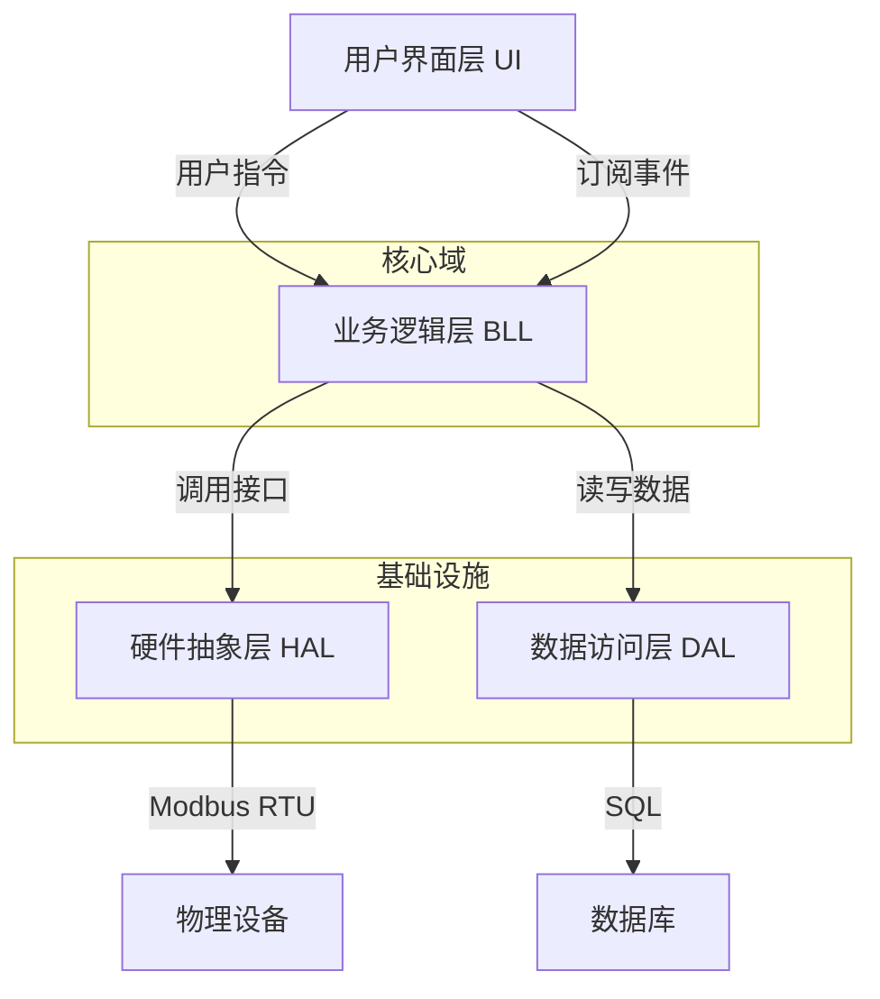
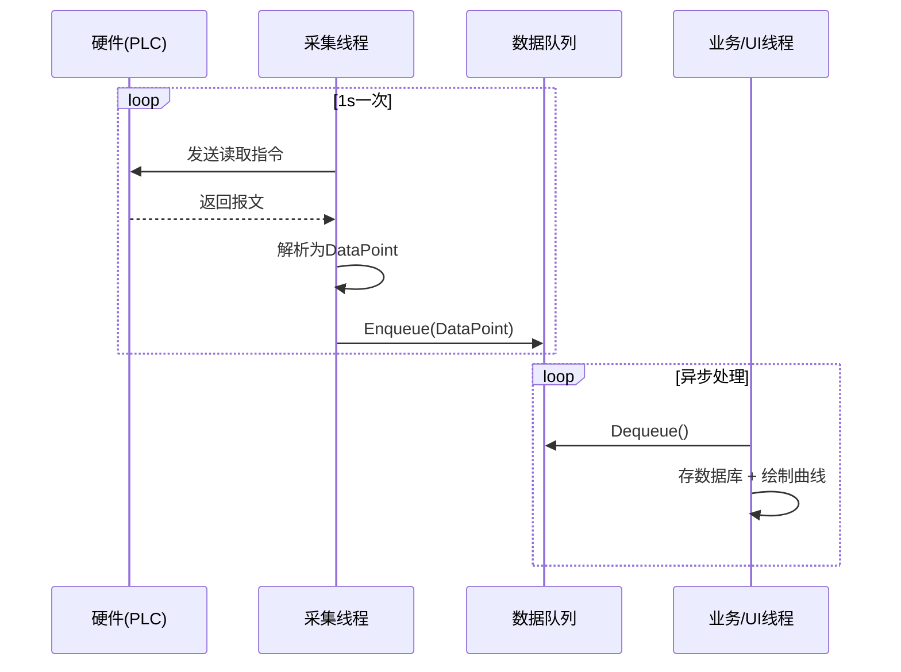

# 第4章 软件架构设计与技术选型

> 第3章我们完成了需求分析——明确了系统"做什么"。现在的问题是："**怎么做？**"用什么编程语言？代码分几层？硬件通信走什么协议？数据存在哪里？
>
> 如果不提前回答这些问题，直接动手写代码，你很可能会写出一个"点击按钮界面就卡死、换个设备整个程序就报废"的系统。本章将带你从架构设计的角度，系统性地回答这些核心问题。

## 学习目标

- **理解** 工业软件架构设计的特殊性（实时性、硬件耦合、长期维护性）
- **掌握** 分层架构模式及其工业变体（UI-BLL-HAL-DAL）
- **学会** 使用"加权评分矩阵"进行科学的技术选型
- **理解** 生产者-消费者模型在工业数据采集中的应用
- **掌握** Modbus RTU协议的基本原理和通信点表设计

---

## 4.1 从"面条代码"到分层架构

在讲解架构理论之前，让我们先看一个真实的"反面教材"，理解**为什么需要架构设计**。

### 4.1.1 初学者的典型错误

初学者最容易写出的代码是**所有逻辑混在一起**——在 `btnStart_Click` 事件中直接写串口打开、发送指令、解析数据、更新UI：

```csharp
private void btnStart_Click(object sender, EventArgs e) {
    serialPort1.Open();              // 1. 操作硬件
    serialPort1.Write("01 03 ...");  // 2. 发送指令
    Thread.Sleep(100);               // 3. 阻塞等待（界面卡死！）
    string resp = serialPort1.ReadExisting();
    if (resp.StartsWith("01")) { ... } // 4. 业务逻辑
    lblTemp.Text = ...;              // 5. 更新UI
}
```

这段代码有三个**致命缺陷**：

| 问题 | 后果 | 根源 |
|------|------|------|
| **UI卡死** | `Thread.Sleep` 导致界面无响应 | 硬件通信阻塞了UI线程 |
| **无法复用** | 另一个按钮也要读温度，只能复制粘贴 | 没有抽取公共逻辑 |
| **硬件耦合** | 换了品牌的温控器，整段代码要重写 | 硬件细节散落在各处 |

### 4.1.2 解决方案：分层架构

分层架构（Layered Architecture）是最经典的解决方案——将系统划分为职责明确的水平层次，每一层只与其相邻的下层交互。

> 💡 **想一想**
>
> 如果不做分层，当实验室更换了新品牌的温控器时（比如从欧姆龙换成西门子），你需要修改多少处代码？修改会散落在哪些文件中？

### 4.1.3 常见的架构风格对比

在确定采用分层架构之前，我们也考察了其他架构风格：

| 架构风格 | 原理 | 工业应用场景 | 优劣势 |
|----------|------|--------------|--------|
| **分层架构** | 水平分层，逐层调用 | 单机桌面控制应用 | ✅ 结构清晰，易于分工 ❌ 层次过多会增加延迟 |
| **事件驱动架构** | 组件通过发布/订阅事件通信 | 复杂SCADA监控系统 | ✅ 高度解耦 ❌ 事件流难以追踪 |
| **管道-过滤器架构** | 数据经过一系列过滤器处理 | 信号处理系统 | ✅ 适合数据流 ❌ 不适合交互式应用 |

> 🔍 **案例实战：本案例的架构决策**
>
> 考虑到不燃性试验系统是逻辑清晰、流程固定的**单机桌面控制应用**，本教材采用**分层架构**作为主干，并在局部（如报警处理）结合**观察者模式（事件驱动）**。

---

## 4.2 工业软件四层架构设计

通用的三层架构（UI-BLL-DAL）在工业领域往往"水土不服"，因为工业软件要直接操作硬件。因此，我们引入了第四层——**硬件抽象层（Hardware Abstraction Layer, HAL）**。

### 4.2.1 架构总览



### 4.2.2 各层职责

| 层次 | 职责 | 关键原则 |
|------|------|----------|
| **UI层** | 显示数据曲线、接收用户指令 | **不包含任何业务逻辑**——不在Button_Click里写温度判断 |
| **BLL层** | 状态机流转、PID计算、合格判定 | 纯逻辑代码，易于单元测试 |
| **HAL层** | 隔离物理硬件差异 | 向上提供统一接口，Mock驱动也在此层实现 |
| **DAL层** | 数据的持久化 | 推荐使用EF Core，避免手写SQL拼接 |

**HAL层的核心思想——依赖倒置**：

```csharp
// 定义统一的硬件接口，屏蔽厂商差异
public interface ITemperatureSensor 
{
    bool Connect();
    double ReadTemperature(int channel); // 返回物理量（如75.0°C）
    void Disconnect();
}
// 无论是欧姆龙、西门子还是Mock模拟器，都实现这个接口
```

> ⚠️ **注意：异常处理的分层原则**
>
> HAL层捕获到通信超时后，**不应直接弹窗**，而应抛出自定义异常或触发事件 `OnDeviceError`。UI层统一订阅该事件，在状态栏显示"通信中断，正在重连..."。这样避免了多重弹窗干扰用户操作。

### 4.2.3 核心设计模式

在四层架构中，以下设计模式几乎是标配：

| 模式 | 解决的问题 | 场景示例 |
|------|------------|----------|
| **单例模式** | 硬件资源的独占性 | 串口只能被打开一次，用单例确保全局唯一 `HardwareManager` |
| **工厂模式** | 多品牌硬件的兼容 | 根据配置动态创建"欧姆龙驱动"或"Mock模拟器" |
| **状态模式** | 复杂的试验流程控制 | 将"待机、预热、试验中、冷却"封装为状态类，避免大量if-else |

---

## 4.3 技术选型

技术选型不能"拍脑袋"，应使用**加权评分矩阵（Weighted Scoring Matrix）**进行科学评估。

### 4.3.1 开发语言选型：C# vs C++ vs Python

| 评估维度 | 权重 | C# (.NET) | C++ (Qt) | Python (PyQt) |
| :--- | :--- | :--- | :--- | :--- |
| **开发效率** | 30% | **5** (IDE强大，库丰富) | 3 (手动管理内存) | **5** (代码少) |
| **运行性能** | 25% | **4** (JIT优化好) | **5** (无GC，硬实时首选) | 2 (GIL限制) |
| **GUI生态** | 20% | **5** (WinForms/WPF原生) | 4 (Qt强大但学习成本高) | 3 (打包体积大) |
| **硬件交互** | 15% | **4** (P/Invoke方便) | **5** (直接操作指针) | 3 (依赖封装) |
| **部署维护** | 10% | **5** (单文件发布) | 3 (DLL依赖) | 3 (环境依赖) |
| **加权总分** | — | **4.65** | 3.85 | 3.75 |

**结论**：选择 **C# (.NET 6)**——在保证足够性能的同时，提供极高的开发效率和优秀的Windows GUI支持。

### 4.3.2 通信协议选型：Modbus RTU vs Modbus TCP

| 维度 | Modbus RTU (RS485) | Modbus TCP (Ethernet) |
| :--- | :--- | :--- |
| **物理介质** | 双绞线（差分信号，抗干扰强） | 网线 (CAT5/6) |
| **传输距离** | 最远1200米 | 最远100米 |
| **硬件成本** | 低（几元的转换芯片） | 高（需以太网芯片） |
| **开发难度** | 需处理CRC校验 | Socket编程更通用 |

**结论**：选择 **Modbus RTU**——它是工业现场最基础的通信协议，学习它有助于理解串行通信的核心概念。协议的详细帧结构和CRC校验将在第5章详细设计中展开。

### 4.3.3 数据存储选型

| 方案 | 优点 | 缺点 | 适用场景 |
| :--- | :--- | :--- | :--- |
| **SQL Server/SQLite** | 查询方便，支持复杂报表 | 大数据量下查询变慢 | **本教材推荐** |
| **时序数据库** (InfluxDB) | 写入快，压缩率高 | 部署复杂，不适合单机 | 大规模分布式SCADA |
| **二进制文件** (.dat) | 速度最快，无依赖 | 无法查询，难以生成报表 | 极高频采集（示波器） |

**结论**：选择 **SQLite / SQL Server Express**——年数据量约180万条，完全胜任，且方便后续数据分析教学。

> � **知识拓展：工业数据的"写多读少"特征**
>
> 工业数据每秒写入，但可能一年才查一次历史记录。这与互联网应用"读多写少"的特征截然不同。本系统每次试验（30分钟）产生约1800条温度记录，选择关系型数据库不仅满足写入需求，更方便后续的SQL报表查询。

---

## 4.4 实时性架构设计

工业软件的"高并发"不是指用户多，而是指**数据量大、频次高**。如果处理不当，数据会堆积，导致"波形延迟"——炉子温度已经降了，界面曲线还在升。

### 4.4.1 传统的"定时器轮询"陷阱

很多新手用 `System.Windows.Forms.Timer` 每秒读硬件。问题是：如果串口通信超时（花了1.5s），UI线程就会卡顿，后续tick堆积，最终系统崩溃。

### 4.4.2 解决方案：生产者-消费者模型

本系统采用经典的**双线程队列模型**：

| 角色 | 实现 | 职责 | 关键点 |
|------|------|------|--------|
| **生产者** | 独立后台线程 | 循环读取硬件 -> 封装为DataPoint -> 入队 | 不做耗时计算，不操作UI |
| **缓冲区** | BlockingCollection\<T\> | 线程安全的"传送带"，设上限防溢出 | 队列满时丢弃旧数据 |
| **消费者** | UI/处理线程 | 从队列取数据 -> 存数据库 + 刷新UI | 通过Invoke切回UI线程 |



> 💡 **想一想**
>
> 如果生产者线程直接调用 `lblTemp.Text = "750°C"` 来更新界面，会发生什么？为什么必须通过 `Invoke` 切换到UI线程？这与第3章提到的"安全性"需求有什么关系？

---

## 4.5 数据库架构设计

### 4.5.1 数据E-R模型

本系统的核心数据实体：

| 实体 | 主键/外键 | 核心字段 | 说明 |
|------|-----------|----------|------|
| **试验记录** TestRecord | PK: TestID (GUID) | 样品编号、试验人员、开始/结束时间、结论 | 一次试验的元数据 |
| **原始数据** RawData | FK: TestID | 时间戳、炉温T1、表面T2、中心T3 | 最庞大的表（30分钟=1800条） |
| **参数配置** SysConfig | PK: Key | Value | Key-Value结构，存储PID参数、串口号等 |

### 4.5.2 Modbus通信点表

通信点表定义了软件如何与硬件设备"对话"——每个变量在设备中的"地址"：

| 信号名称 | 寄存器地址 | PLC地址 | 数据类型 | 读/写 | 说明 | 单位 |
| :--- | :--- | :--- | :--- | :--- | :--- | :--- |
| **炉内温度** | 0x0000 | 40001 | Int16 | R | 原始值需除以10 | °C |
| **表面温度** | 0x0001 | 40002 | Int16 | R | 原始值需除以10 | °C |
| **中心温度** | 0x0002 | 40003 | Int16 | R | 原始值需除以10 | °C |
| **设定温度(SV)** | 0x0009 | 40010 | Int16 | R/W | PID控制目标值 | °C |
| **加热输出** | 0x000A | 40011 | Int16 | R | 输出百分比(0-1000) | 0.1% |
| **启动加热** | 0x0000 | 00001 | Coil | R/W | 线圈，ON=启动 | — |

> 📘 **知识拓展：Modbus协议简介**
>
> Modbus RTU是"主从式"（Master-Slave）协议——上位机（Master）发送请求，仪表（Slave）返回数据。每帧包含：地址码（1B）+ 功能码（1B）+ 数据区（NB）+ CRC校验（2B）。例如读取1号仪表的炉温：发送 `01 03 00 00 00 01 ...`，仪表返回 `01 03 02 02 EE ...`（0x02EE = 750，即75.0°C）。Modbus协议的帧结构、CRC校验和大小端等细节将在第5章详细设计中深入讲解。

---

## 本章小结

本章从一段"面条代码"出发，逐步引导读者理解架构设计的必要性，并完成了系统的技术蓝图设计。

**关键知识点**：

*   工业软件采用**四层架构（UI-BLL-HAL-DAL）**，HAL层是区别于通用软件的关键
*   技术选型应使用**加权评分矩阵**进行科学评估：C#用于开发语言，Modbus RTU用于通信协议，SQL用于数据存储
*   **生产者-消费者模型**解决了工业数据采集中的实时性和线程安全问题
*   **设计模式**（单例、工厂、状态）在工业控制中是标配
*   通信点表是软硬件对接的核心文档

**与前后章节的关系**：
*   第3章定义了"系统做什么" → 本章回答了"系统怎么做"
*   本章确定了架构蓝图 → 第5章将在此基础上进行详细设计（类图、接口规范、Modbus协议细节）

---

## 思考与练习

1. 为什么工业软件需要HAL层？如果没有这一层，当更换硬件厂商时会面临什么问题？
2. 在加权评分矩阵中，如果将"运行性能"的权重提高到50%，选型结果会如何变化？
3. 解释生产者-消费者模型中，为什么生产者线程不能直接操作UI。
4. 对照第3章的功能需求（F1-F4），思考每个功能模块应该放在四层架构的哪一层？

---

## 本章作业

**作业**：设计系统的架构蓝图

**要求**：

1. 使用Visio或ProcessOn绘制本系统的详细四层架构图，并说明当用户点击"开始"按钮后，指令如何穿透四层到达硬件
2. 对照第3章定义的功能需求（F1-F4），将每个功能点分配到四层架构中，说明分配理由
3. 假设项目需求变更为"需要支持手机远程查看数据"，请使用加权评分矩阵对比HTTP (RESTful API) 和 MQTT协议，给出选择

**提交格式**：PDF报告，文件命名为"第4章作业_架构设计_小组X_组长姓名.pdf"

**截止时间**：两周后

**评分标准**：

| 评分项 | 分值 | 评分要点 |
|--------|------|----------|
| 架构图设计 | 30分 | 四层划分清晰，数据流向正确 |
| 功能分配 | 30分 | 与第3章需求对应，分配理由合理 |
| 协议选型分析 | 40分 | 评分矩阵维度合理，分析有理有据 |
| **总分** | **100分** | |

**提示**：

- 架构图中应标注各层之间的接口和数据流方向
- 功能分配时注意"UI层不应包含业务逻辑"的原则
- MQTT选型分析应考虑工业场景的特殊需求（如QoS、断网重连）
