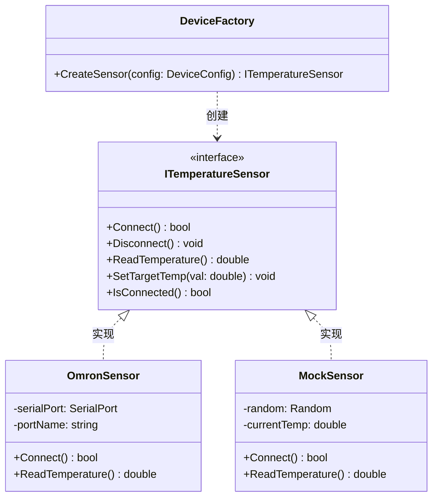
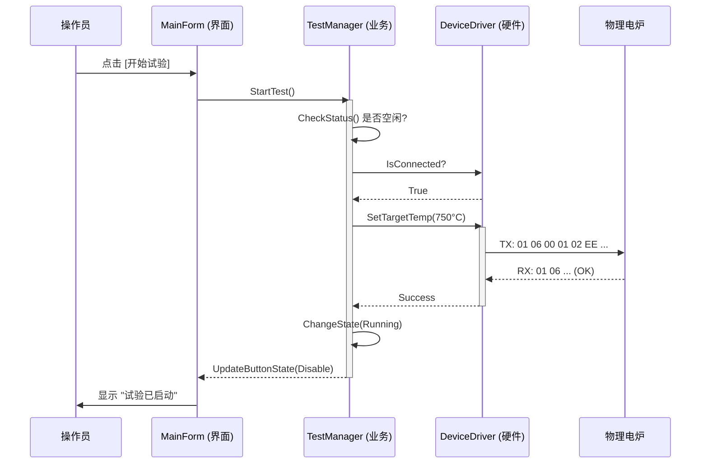
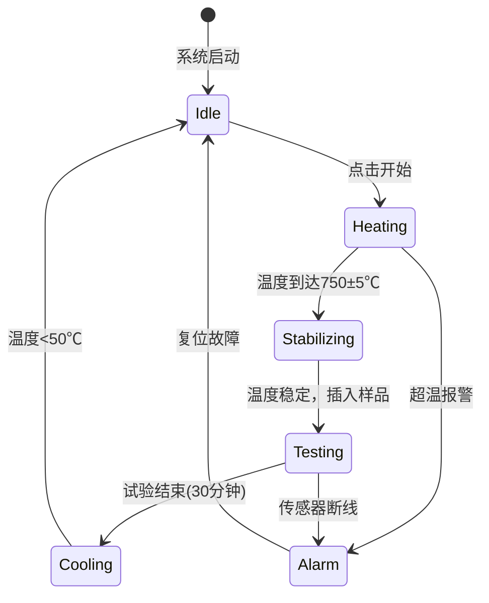

# 第5章 详细设计与设计报告编写

> 第4章我们确定了系统的架构蓝图——四层架构和技术选型。但架构只是骨架，还需要"长出肌肉和血管"：每个模块里有哪些类？类之间如何协作？试验流程如何在代码中流转？界面上的按钮在什么状态下该禁用？
>
> 本章将深入到**类和方法**的粒度，完成从架构到代码之间的"最后一公里"设计。

## 学习目标

- **掌握** 面向对象的详细设计方法，能够绘制类图与时序图
- **理解** 工业控制系统中状态机（State Machine）的设计与实现
- **掌握** 工业HMI界面设计规范，能够设计符合安全要求的操作界面
- **了解** 异常处理与日志策略在工业软件中的重要性
- **能够** 撰写符合IEEE 1016标准的《软件详细设计说明书》

---

## 5.1 模块详细设计与UML建模

在第4章确定的四层架构基础上，详细设计需要深入到"类"和"方法"的粒度。本节不仅关注静态结构，更关注动态行为。

### 5.1.1 静态结构：硬件抽象层的类图设计

为了实现第4章提出的HAL层"依赖倒置"原则——无论更换什么品牌的硬件，上层代码都不需要修改——我们使用**工厂模式 + 策略模式**：



> 🔍 **案例实战：MockSensor的教学价值**
>
> `MockSensor` 利用正弦函数 `Math.Sin(Time)` 叠加随机噪声来模拟真实的温度曲线，让学生即使在宿舍也能完成全流程开发。这正是第3章非功能需求中"Mock Support"在代码中的体现。

### 5.1.2 动态行为：启动试验的时序图

详细设计不仅要画出"类"，还要画出"类之间如何协作"。以下是用户点击"开始试验"后的协作过程：



> 💡 **想一想**
>
> 在时序图中，为什么UI不直接调用HAL层，而是通过BLL层中转？回顾第4章的分层原则——如果UI直接操作硬件，那当业务规则变化时（比如需要先校准天平再开始），你需要修改UI代码，违反了"UI层不含业务逻辑"的原则。

### 5.1.3 状态机设计

温度控制系统是一个典型的状态机。简单的 `if-else` 不足以管理复杂的工业逻辑。



> ⚠️ **注意：状态互锁是安全关键**
>
> 每个状态下，按钮行为必须不同：**试验中**状态下"参数设置"按钮必须禁用；**报警**状态下只有"复位"按钮可用。这种"状态互锁"是工业安全的基本要求。

---

## 5.2 核心业务类设计

UML类图只是骨架，本节将核心业务逻辑细化到C#代码层面。

### 5.2.1 TestManager（试验控制器）

这是整个系统的"指挥官"，负责协调硬件、记录数据和状态流转：

```csharp
public class TestManager
{
    public TestState CurrentState { get; private set; }
    public TestInfo CurrentTestInfo { get; private set; }
    
    // 事件定义（观察者模式，UI订阅这些事件来更新界面）
    public event EventHandler<TempEventArgs> OnTempUpdated;
    public event EventHandler<StateChangedEventArgs> OnStatusChanged;

    public async Task StartTestAsync(string sampleId)
    {
        if (CurrentState != TestState.Idle) 
            throw new InvalidOperationException("系统必须在空闲状态才能启动！");

        CurrentTestInfo = new TestInfo { SampleId = sampleId, StartTime = DateTime.Now };
        if (!_deviceDriver.IsConnected) await _deviceDriver.ConnectAsync();

        ChangeState(TestState.Heating);
        _cts = new CancellationTokenSource();
        _ = Task.Run(() => ControlLoop(_cts.Token));  // 启动后台控制循环
    }

    private async Task ControlLoop(CancellationToken token)
    {
        while (!token.IsCancellationRequested)
        {
            try 
            {
                var data = await _deviceDriver.ReadDataAsync();        // A. 读取硬件
                double power = _pidController.Compute(data.FurnaceTemp, _targetTemp); // B. PID计算
                await _deviceDriver.SetPowerAsync(power);              // C. 输出控制
                OnTempUpdated?.Invoke(this, new TempEventArgs(data));  // D. 通知UI
            }
            catch (Exception ex)
            {
                await EmergencyStopAsync();  // 异常时紧急停止
                _logger.Error(ex, "Control loop failed");
            }
            await Task.Delay(1000); // 1s周期
        }
    }
}
```

### 5.2.2 PIDController（温度控制算法）

PID算法是工业控制的灵魂。虽然有现成的库，但手写一遍能加深理解：

```csharp
public class PIDController
{
    public double Kp { get; set; } = 2.0;  // 比例系数
    public double Ki { get; set; } = 0.5;  // 积分系数
    public double Kd { get; set; } = 0.1;  // 微分系数

    private double _integral = 0;
    private double _lastError = 0;

    public double Compute(double currentTemp, double targetTemp)
    {
        double error = targetTemp - currentTemp;

        _integral += error;
        _integral = Math.Clamp(_integral, -100, 100);  // 抗积分饱和

        double derivative = error - _lastError;
        double output = (Kp * error) + (Ki * _integral) + (Kd * derivative);
        
        _lastError = error;
        return Math.Clamp(output, 0, 100);  // 归一化输出（0-100%）
    }
}
```

> 📘 **知识拓展：什么是"积分饱和"？**
>
> 当温度长时间低于目标值时，积分项会持续累加，导致控制输出"过冲"。`Math.Clamp` 限制积分项的范围，防止温度大幅超调。这是工业PID调参的常见技巧。

---

## 5.3 工业HMI界面设计

**ASM（Abnormal Situation Management）** 联盟提出的HMI设计规范是全球工业界公认的标准。其核心理念是：**仅在需要时显示信息，不要让"花哨"干扰了"安全"**。

### 5.3.1 配色方案：颜色必须有语义

| 颜色 | 十六进制 | 语义 | ASM规范说明 |
| :--- | :--- | :--- | :--- |
| **背景色** | `#2D2D30` (深灰) | 无 | 低对比度中性色，减少视觉疲劳 |
| **正常数据** | `#D4D4D4` (浅灰) | 静态/正常 | 正常数值、标签均使用淡灰色 |
| **警告** | `#FFC107` (黄) | Warning | 非紧急但需注意（如温度偏高但未超限） |
| **报警** | `#FF3333` (红) | Alarm | **紧急且必须立即处理。红色只能用于报警！** |
| **运行** | `#339933` (绿) | Running | 设备正在运行状态 |

### 5.3.2 主控界面原型

采用**单窗口、多区域**设计，让操作员尽量少弹窗：

```text
+-------------------------------------------------------------+
| [Logo]  建筑材料不燃性试验系统 V1.0      [状态: 正在试验]   |  <-- 顶部状态栏
+-------------------------------------------------------------+
|  +---------------------+  +------------------------------+  |
|  |   实时数据区 (大字) |  |        实时曲线区            |  |
|  | 炉温: 750.5 °C      |  |  ^ Temp         _______     |  |
|  | 表温: 748.2 °C      |  |  |              /            |  |
|  | 心温: 749.1 °C      |  |  |_____________/________     |  |
|  | 功率: 45%           |  |  +-------------------> Time  |  |
|  +---------------------+  +------------------------------+  |
|  +---------------------+  +------------------------------+  |
|  |    操作控制区       |  |        试验日志区            |  |
|  | [开始] [停止] [复位]|  | 10:00:01 启动加热            |  |
|  | [参数设置] [报告]   |  | 10:15:20 到达恒温            |  |
|  +---------------------+  +------------------------------+  |
+-------------------------------------------------------------+
```

### 5.3.3 交互逻辑

| 交互场景 | 设计规则 |
|----------|----------|
| **状态互锁** | Running状态下"参数设置"禁用；Alarm状态下只有"复位"可用 |
| **曲线交互** | 支持鼠标滚轮缩放X轴（时间）；悬停显示(时间,温度)Tooltip |
| **输入校验** | 目标温度必须在100-1100范围内，超出则边框变红并提示"超出范围" |
| **权限控制** | PID参数只能由管理员修改（需输入密码），防止操作员误触导致控制失稳 |
| **安全退出** | 退出时若炉温>50℃，弹出红色警告："炉温过高，建议冷却后再退出！" |

---

## 5.4 异常处理与日志策略

工业软件必须是"健壮的"——不能让一个未捕获的异常导致整个程序崩溃。

### 5.4.1 防御性编程

| 原则 | 说明 |
|------|------|
| **边界捕获** | 仅在最外层或边界（串口IO、数据库连接）使用Try-Catch |
| **不吞异常** | 禁止Empty Catch Block——至少记录日志 |
| **全局兜底** | 在`Program.cs`注册`UnhandledException`事件，崩溃时记录堆栈并安全关闭硬件 |

### 5.4.2 结构化日志

推荐使用**NLog**或**Serilog**，写结构化日志而非纯文本：

*   ❌ `Log.Error("Connection failed")` — 哪台设备？什么时间？
*   ✅ `Log.Error("Connection failed for DeviceId={DeviceId} at {Time}", 101, DateTime.Now)`

### 5.4.3 操作审计（Audit Trail）

> 📘 **知识拓展：为什么需要审计追踪？**
>
> 在FDA 21 CFR Part 11及很多工业标准中，要求系统必须记录"谁，在什么时候，做了什么操作"。例如：某天炉子烧坏了，通过审计日志发现是实习生昨晚11:30把PID的Kp改成了100（导致剧烈震荡）。审计日志在界面上**不可删除**，这是工业软件合规性的底线。

审计日志的表结构示例：

| 字段名 | 类型 | 说明 | 示例 |
| :--- | :--- | :--- | :--- |
| LogId | BigInt | 自增主键 | 1024 |
| Operator | NVarChar(50) | 操作员 | "Admin" |
| EventTime | DateTime | 时间 | 2026-05-20 14:30:00 |
| Operation | NVarChar(50) | 操作类型 | "ModifyParam" |
| Detail | NVarChar(MAX) | 详情 | "修改目标温度: 750 -> 800" |

---

## 5.5 设计报告编写规范

一份专业的设计报告（SDD, Software Design Description）是向评委和甲方展示技术实力的关键。推荐参照 **IEEE 1016** 标准：

| 章节 | 内容 |
|------|------|
| **1. 引言** | 编写目的、范围、术语定义 |
| **2. 系统架构** | 四层架构图，各层职责说明（引用第4章内容） |
| **3. 动态模型** | 时序图（启动流程）、状态机图（炉温控制） |
| **4. 详细设计** | 核心类的属性方法列表、数据库ER图和表结构、界面原型图 |
| **5. 接口设计** | Modbus通信点表（引用第4章内容）、配置文件格式 |

> 🔍 **案例实战：设计报告中最容易被扣分的地方**
>
> - **只画了类图，没画时序图** — 评委想知道"类如何协作"，而不仅仅是"有哪些类"
> - **界面只有截图，没有交互说明** — 漂亮不等于好用，必须说明按钮在各状态下的启用/禁用规则
> - **没有异常处理设计** — 第3章说了"断线保护"是NFR，设计报告必须体现这些是如何落地的

---

## 本章小结

本章完成了从架构蓝图到代码实现之间的详细设计工作，为后续的编码实现提供了精确指导。

**关键知识点**：

*   UML类图定义静态结构，时序图描述动态协作，状态机管理流程流转
*   `TestManager` 是系统的核心控制器，协调硬件、算法和界面
*   PID算法是工业温度控制的灵魂，抗积分饱和是实际调参的关键技巧
*   工业HMI设计遵循ASM规范：颜色有语义、状态互锁、权限控制
*   异常处理应"边界捕获、不吞异常、全局兜底"，审计日志是合规性底线

**与前后章节的关系**：
*   第4章确定"系统怎么组织" → 本章细化到"每个类怎么写"
*   本章设计的类图和接口 → 第6-12章将逐一实现这些模块

---

## 思考与练习

1. 在状态机设计中，为什么需要一个独立的"Alarm"状态？如果直接在其他状态中处理报警，会有什么问题？
2. 审视 `TestManager.ControlLoop` 中的异常处理：为什么异常发生时要先调用 `EmergencyStopAsync()` 再记录日志，而不是反过来？
3. 如果操作员在"试验中"状态强行关闭程序（如Alt+F4），系统应如何保护数据和硬件安全？请设计一个方案。
4. 根据ASM配色规范，分析你平时使用的手机App界面——它们的颜色使用是否符合工业安全标准？差异在哪里？

---

## 本章作业

**作业**：完成《详细设计说明书》核心章节 V1.0

**要求**：

1. 绘制本系统的**状态机图**，包含"待机、预热、稳定、试验、报警"五个状态及流转条件
2. 绘制"开始试验"到"生成报告"的**完整时序图**，至少涉及UI、BLL、HAL三层
3. 设计主控界面的**交互逻辑表**，说明每个按钮在各状态下的启用/禁用规则
4. 参照IEEE 1016模板，撰写一份不少于5页的设计报告初稿

**提交格式**：Word/PDF + 源码工程，文件命名为"第5章作业_详细设计_小组X_组长姓名"

**截止时间**：两周后

**评分标准**：

| 评分项 | 分值 | 评分要点 |
|--------|------|----------|
| 状态机图 | 25分 | 状态完整，流转条件清晰，包含异常状态 |
| 时序图 | 25分 | 分层正确，消息方向清楚，包含异常流 |
| 交互逻辑 | 20分 | 覆盖所有状态，规则合理，体现安全互锁 |
| 设计报告 | 30分 | 结构完整，图文并茂，符合IEEE 1016 |
| **总分** | **100分** | |

**提示**：

- 状态机图可用Mermaid或Visio绘制
- 时序图中应体现"异常时紧急停止"的分支
- 交互逻辑可以用表格形式：行=按钮，列=状态，单元格=启用/禁用
- 设计报告应引用第4章的架构设计作为基础
