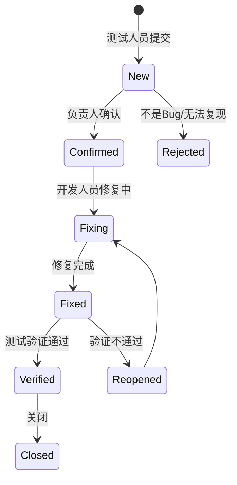

# 第7章 项目团队协作与文档管理

> 前六章我们完成了一个完整的准备工作链条：可行性分析（第2章）→ 需求定义（第3章）→ 架构设计（第4章）→ 详细设计（第5章）→ 版本控制搭建（第6章）。现在，工具和蓝图都已就绪，是时候**组建团队开始编码**了。
>
> 但三个人同时写代码，谁写UI？谁写硬件驱动？代码写完谁来审查？文档跟不上代码怎么办？本章将介绍工业软件项目中的团队协作方法——如何在"硬件没到货"的约束下高效推进软件开发。

## 学习目标

- **理解** 工业软件项目的团队角色分工与软硬结合部的协调
- **掌握** 敏捷开发在工业场景下的改良应用（双流迭代策略）
- **精通** 工业级代码审查流程与安全检查清单
- **学会** 建立"文档即代码"(Docs as Code) 管理体系
- **能够** 组织Sprint Planning会议并管理缺陷生命周期

---

## 7.1 工业项目团队角色与职责

工业软件项目不同于纯互联网项目，它涉及**OT（运营技术）**与**IT（信息技术）**的深度融合。回顾第2章的项目计划——WBS中的任务不仅有"写代码"，还有"电气接线"和"PLC调试"。

### 7.1.1 核心角色

| 角色 | 职责 | 工业特色 |
|------|------|----------|
| **产品负责人(PO)** | 定义产品愿景，管理产品待办列表 | 通常由**懂工艺的专家**担任——他们知道"炉温波动超过5°C意味着什么" |
| **Scrum Master** | 消除障碍，确保团队遵循敏捷流程 | 主要工作是"打通软硬壁垒"，协调硬件到货延迟与软件进度 |
| **上位机工程师** | C# WinForms界面、核心算法、数据库 | 本教材的核心角色 |
| **下位机工程师** | PLC梯形图、变频器调试、电气柜接线 | 需要与上位机工程师密切配合通信协议 |
| **测试与QA** | FAT/SAT验收测试 | 必须敢于在真实设备上做"破坏性测试"（拔网线、断电） |

> 💡 **想一想**
>
> 回顾第4章的四层架构（UI-BLL-HAL-DAL），如果团队有3名上位机工程师，你会如何分配任务？是按层（一人写UI、一人写BLL、一人写HAL/DAL），还是按功能（一人做温度采集、一人做报告生成、一人做参数管理）？各有什么优缺点？

---

## 7.2 敏捷开发的工业化改良

敏捷宣言提倡"响应变化高于遵循计划"，但在工业领域，硬件变更成本极高。因此需要**双流迭代策略（Dual-Track Agile）**。

### 7.2.1 双流迭代策略

工业项目由"硬件流"和"软件流"并行推进，但节拍不同：

| 流 | 周期 | 产出 | 关键约束 |
|----|------|------|----------|
| **Discovery（硬件/探索流）** | 4周 | 硬件接口文档、电气原理图 | 打样周期长，变更成本高 |
| **Delivery（软件/交付流）** | 2周 | 可运行的软件版本 | 可快速迭代，但依赖硬件接口 |

**同步机制**：
*   **Mock First（仿真先行）**：在硬件打样期间，软件团队利用第5章设计的MockSensor开发业务逻辑
*   **集成周**：每2个软件Sprint结束时，与最新的硬件样品联调

> 🔍 **案例实战：硬件没到货怎么办？**
>
> Sprint 1的目标是完成"串口通信模块"，但PLC还没到货，只有一份《Modbus点表 V0.9》（第4章4.5.2节定义的那张表）。正确做法：先根据点表实现`MockSensor`（第5章5.1.1节设计的类），用模拟数据跑通全流程，硬件到货后只需切换工厂模式的配置即可。

### 7.2.2 工业看板设计

工业看板必须包含"硬件就绪"这个关键列：

| Backlog | 软硬拆解 | 硬件就绪 | 软件开发 | 软硬联调 | 现场验收 | Done |
| :--- | :--- | :--- | :--- | :--- | :--- | :--- |
| 温控功能 | PLC梯形图 + 上位机PID | ✅ 炉子通电 | C#编码中 | **关键！** | 操作工试用 | ✅ |

> ⚠️ **注意：软件任务在"硬件就绪"之前，只能使用Mock开发**
>
> 只有硬件就绪并通过基本测试后，任务才能进入"软硬联调"阶段。这是工业项目与互联网项目最大的流程差异。

---

## 7.3 代码审查与质量控制

在工业控制软件中，一个Bug造成的后果不是页面404，而是设备撞机或火灾。代码审查是最后一道防线。

### 7.3.1 工业软件安全检查清单

Reviewer必须拿着这份清单逐项核对：

**I. 安全性 — 最为关键**

- [ ] **急停逻辑**：软件急停是否直接切断关键输出？（对应第3章的NFR"急停响应"）
- [ ] **边界值保护**：传感器读数是否过滤了异常值？（如温度突变为99999）
- [ ] **心跳监测**：通信中断3秒是否自动报警？（对应第3章的NFR"断线保护"）

**II. 稳定性**

- [ ] **异常兜底**：所有线程入口是否包裹了try-catch？（对应第5章的异常处理策略）
- [ ] **资源释放**：SerialPort/Socket/FileStream是否用了`using`或`Dispose()`？
- [ ] **防御性编程**：解析前是否检查了CRC和数据长度？

**III. 性能**

- [ ] **UI假死**：耗时操作是否在后台线程执行？（对应第4章的"定时器轮询陷阱"）
- [ ] **日志风暴**：高频循环中是否疯狂写日志？（应降频或异步写入）

### 7.3.2 代码审查实战

> 🔍 **案例实战：一段危险的串口接收代码**
>
> ```csharp
> // ❌ 原始代码（找找Bug）
> public void ParseData(byte[] buffer)
> {
>     lblTemp.Text = "Temp: " + buffer[0];      // Bug 1
>     int val = int.Parse(Encoding.ASCII.GetString(buffer)); // Bug 2
>     var file = File.OpenWrite("log.txt");      // Bug 3
>     file.Write(buffer, 0, buffer.Length);
> }
> ```

**审查意见**：

| 行 | 问题 | 严重等级 | 修改建议 |
| :--- | :--- | :--- | :--- |
| 1 | **线程安全** | 🔴 Fatal | 串口回调在后台线程，严禁直接访问UI控件，必须用`Invoke` |
| 2 | **健壮性** | 🔴 Fatal | buffer为乱码时`int.Parse`会Crash，必须用`TryParse`+try-catch |
| 3 | **资源泄露** | 🟡 Major | FileStream未关闭，长时间运行耗尽句柄，必须用`using` |
| 3 | **性能** | 🟡 Major | 不能在热路径频繁开关文件，应使用异步日志队列 |

**修正后的代码**：

```csharp
public void ParseData(byte[] buffer)
{
    try 
    {
        string raw = Encoding.ASCII.GetString(buffer);
        if (int.TryParse(raw, out int val))
        {
            this.Invoke((MethodInvoker)delegate {
                lblTemp.Text = $"Temp: {val}";
            });
            Logger.AsyncWrite(val);  // 异步日志
        }
    }
    catch (Exception ex) { Logger.Error("Parse failed", ex); }
}
```

---

## 7.4 文档管理：Docs as Code

工业项目文档（需求、设计、验收报告）往往严重滞后于代码。回顾前六章——我们产出了SRS（第3章）、架构设计（第4章）、详细设计（第5章）等大量文档，如何确保它们跟上代码的变化？

### 7.4.1 核心原则

| 原则 | 做法 | 好处 |
|------|------|------|
| **文档与代码同源** | Markdown文档存放在Git仓库的`docs/`目录 | 第6章建立的版本控制自动管理文档版本 |
| **版本同步** | release/v1.0分支的代码对应v1.0的文档 | 不会出现"代码是新的，文档是旧的" |
| **自动生成API文档** | C#用XML注释 + DocFX自动生成 | 代码改了，文档自动更新 |

### 7.4.2 知识库建设

推荐使用GitBook或MkDocs部署团队内部知识库：

*   **环境搭建指南**：新人入职手册
*   **架构决策记录（ADR）**：记录"为什么选Modbus RTU而不是TCP"（第4章的选型理由）
*   **故障排查树**：现场常见问题及解决步骤

> 📘 **知识拓展：架构决策记录（ADR）**
>
> ADR是一种简短的文档格式，记录每个重大技术决策的背景、方案对比和最终选择。例如第4章中C# vs C++ vs Python的加权评分矩阵，就应该作为一条ADR永久保存。这样，后来的团队成员就不会盲目质疑"为什么不用Python"。

---

## 7.5 缺陷跟踪与复盘

### 7.5.1 Bug的生命周期



### 7.5.2 严重等级定义

在工业现场，Bug等级定义不清晰会引发推诿扯皮：

| 等级 | 定义 | 示例 | 响应时限 |
| :--- | :--- | :--- | :--- |
| **P0 致命** | 系统崩溃、安全隐患 | 急停失效、炉温失控、数据丢失 | **2小时内** |
| **P1 严重** | 主要功能失效，有临时规避方案 | 自动打印失败（可手动导出） | **24小时内** |
| **P2 一般** | 次要功能缺陷 | 曲线缩放卡顿、界面错别字 | 下个Sprint |
| **P3 建议** | 易用性建议 | 按钮颜色、字体大小 | 视情况排期 |

> ⚠️ **注意：P0级Bug的处理原则**
>
> 回顾第3章的安全性需求和第5章的异常处理设计——任何涉及"急停失效"或"炉温失控"的Bug，必须在2小时内修复或给出规避方案，并启动第6章介绍的hotfix分支流程。

---

## 本章小结

本章介绍了工业软件项目的团队协作方法和质量保障体系，为即将开始的编码实现提供了管理层面的支撑。

**关键知识点**：

*   工业项目团队涉及OT与IT融合，角色分工需覆盖软硬件两条线
*   双流迭代策略（Mock First + 集成周）解决了软硬件开发节拍不同步的问题
*   代码审查清单分为安全性、稳定性、性能三个维度，安全性最为关键
*   "文档即代码"确保文档与代码版本同步，利用第6章的Git体系自动管理
*   Bug严重等级应与工业安全等级挂钩，P0级必须2小时内响应

**与前后章节的关系**：
*   第2-5章产出了项目文档 → 本章的Docs as Code确保这些文档持续更新
*   第6章搭建了版本控制 → 本章的分支策略和Code Review在此基础上运作
*   本章建立了协作体系 → 第8-12章编码实现阶段将在此框架下进行

---

## 思考与练习

1. 在双流迭代策略中，如果硬件延期2周才到货，软件团队应如何调整Sprint计划？Mock开发有哪些局限性？
2. 回顾第5章的`TestManager.ControlLoop`代码，用本章的安全检查清单审查它——是否满足所有检查项？
3. 如果团队有4个人，参考第4章的四层架构，设计一个合理的任务分配方案，并说明分配依据。
4. 为什么Bug等级中"急停失效"是P0而不是P1？如果将其降级为P1，可能导致什么后果？

---

## 本章作业

**作业**：模拟首次Sprint Planning与Code Review

**要求**：

1. 假设项目进入Sprint 1，目标是完成"串口通信模块"，但PLC还没到货。制定Sprint Backlog（须包含"编写MockSensor"任务）
2. 使用本章7.3.1节的安全检查清单，审查以下代码片段中的所有Bug：
   ```csharp
   void DataReceived(object sender, SerialDataReceivedEventArgs e) {
       SerialPort sp = (SerialPort)sender;
       string data = sp.ReadExisting();    // 粘包问题
       this.textBox1.Text = data;          // 跨线程崩溃
       Log(data);                          // 高频IO卡顿
   }
   ```
3. 手写修复后的代码，并解释每处修改的理由
4. 绘制Sprint Backlog的看板（包含"硬件就绪"列）

**提交格式**：PDF报告 + 修复后的C#代码文件，文件命名为"第7章作业_团队协作_小组X_组长姓名"

**截止时间**：两周后

**评分标准**：

| 评分项 | 分值 | 评分要点 |
|--------|------|----------|
| Sprint Backlog | 25分 | 任务拆分合理，包含Mock任务，标注硬件依赖 |
| Bug识别 | 25分 | 找出所有Bug并正确分类严重等级 |
| 代码修复 | 30分 | 修复正确，代码规范，解释清晰 |
| 看板设计 | 20分 | 包含工业特有列，任务状态清晰 |
| **总分** | **100分** | |

**提示**：

- Sprint Backlog应参考7.2.2节的工业看板格式
- Bug审查应逐项对照7.3.1节的检查清单
- 代码修复可参考7.3.2节的修正后代码示例
- 看板中"硬件就绪"列是区分工业看板与普通看板的关键
